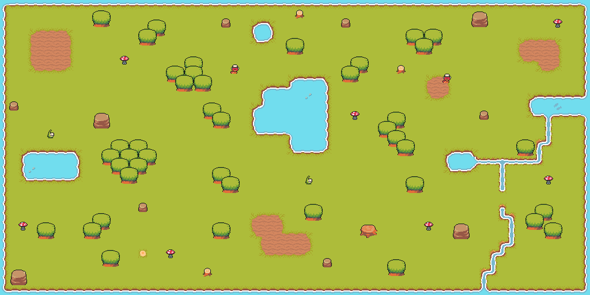
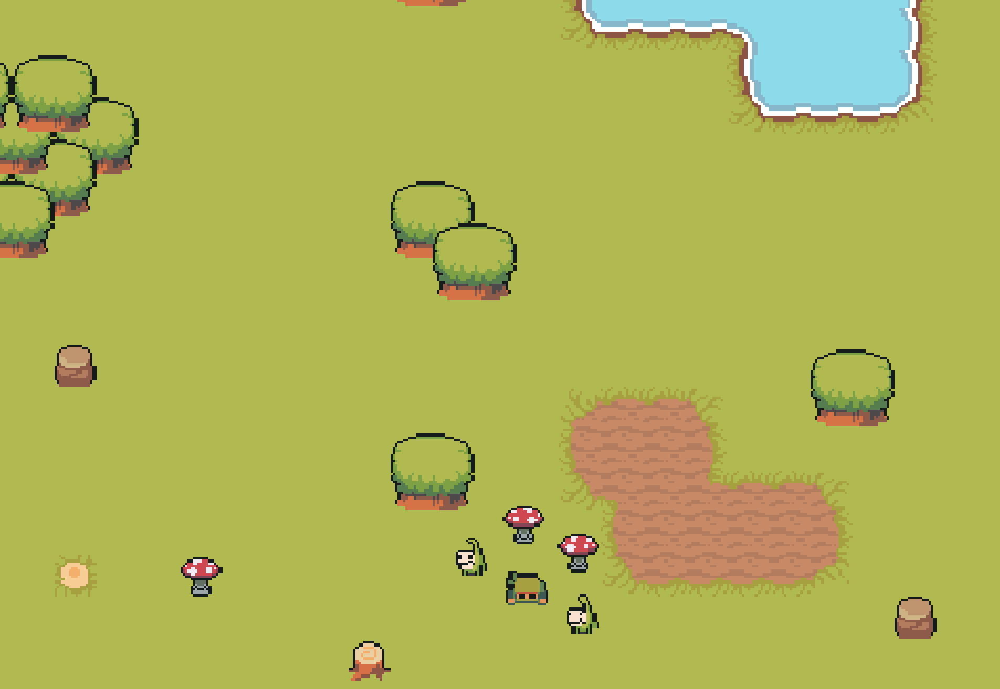

# Survival Ninja Game
A lone green ninja tries to survive in a world full of monsters.

[Follow this link to play!](https://alexfranco12.github.io/survival-ninja-game/)

## Playing The Game

## Screenshots

## Wireframes

## Technologies / Frameworks
- Phaser 3
- Javascript
- HTML
- GitHub

### Assets created by:
[Pixel-Boy](https://pixel-boy.itch.io/)
[AAA](https://www.instagram.com/challenger.aaa/?hl=fr)

Patreon: https://www.patreon.com/pixelarchipel 
Itchio Page: https://pixel-boy.itch.io/
Pack Page: https://pixel-boy.itch.io/ninja-adventure-asset-pack

## User Stories
- As a user, I want to move around the map freely.
- As a user, I want to fight enemies.
- As a user, I want to collect resources.
- As a user, I want to win the game.
- As a user, I want to lose the game.

## MVP Goals
- [x] Create a map
- [x] Create a main player
- [x] Create enemies
- [x] Create nature resources
- [x] Create a win/lose situation

## Major Hurdles
- Create animation for when player is running in curtain directions
- Creating drops for objects that were destroyed
- Creating sounds when items are hit or picked up
- Load enemy objects into game
- Having each enemy move according to their respective spritesheet
- Setting camera to follow main player
- Deploying with all images displaying properly

## Stretch Goals
#### Map
- [ ] Add background music
- [ ] Fix overlapping objects
- [ ] Create more loot that drops from objects when destroyed
- [ ] Create more locations to travel through
- [ ] Create buildings to enter
- [ ] Create NPCs

#### Player
- [ ] Display Health Bar
- [ ] Swing weapon in the direction the ninja is facing
- [ ] Create an inventory
- [ ] Create more weapons
- [ ] Buy and sell items

#### Enemies
- [ ] Create enemies with projectiles
- [ ] Each type of enemies has different attack speeds
- [ ] Create boss levels

## Credits
- Codecademy - Game Development with Phaser.js
- Web & Game Development Tutorials by Morgan Page
- Phaser.io API Documents